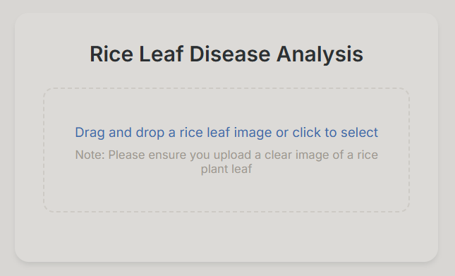
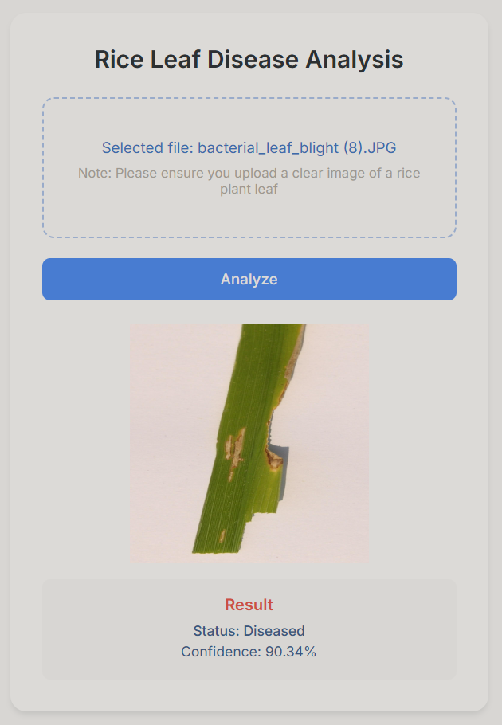

# Rice Leaf Disease Detection System

An AI-powered web application that detects diseases in rice plant leaves using deep learning.

## Live Demo

You can access the live demo of the application at [Rice Leaf Disease Detector](https://rice-leaf-disease-detector.onrender.com).

## Features

- Real-time disease detection
- User-friendly web interface
- Drag & drop image upload
- Instant analysis results
- Support for JPG and PNG formats
- Confidence score display

## Technologies Used

- **Frontend:** HTML, CSS, JavaScript
- **Backend:** Flask (Python)
- **Deep Learning:** TensorFlow, Keras
- **Image Processing:** Pillow

## Project Structure

```
rice-leaf-disease-detector/
├── model/
│   └── model.keras
├── templates/
│   └── index.html
├── static/
│   ├── css/
│   │   └── styles.css
│   ├── js/
│   │   └── scripts.js
├── screenshots/
│   ├── home_page.png
│   └── analysis_result.png
├── app.py
├── requirements.txt
└── README.md
```

## Installation

1. Clone the repository
```bash
git clone (https://github.com/MutlucanKarinca/rice-leaf-disease-detector)
cd rice-leaf-disease-detector
```

2. Create a virtual environment (recommended)
```bash
python -m venv venv
source venv/Scripts/activate  # On Windows
source venv/bin/activate      # On Unix or MacOS
```

3. Install dependencies
```bash
pip install -r requirements.txt
```

4. Run the application
```bash
python app.py
```

The application will be available at `http://localhost:5000`

## Model Information

The deep learning model is trained to detect diseases in rice plant leaves. It uses a binary classification approach:
- Healthy: Indicates a healthy rice plant leaf
- Diseased: Indicates presence of disease in the leaf

## Usage

1. Open the web application in your browser
2. Upload an image by dragging and dropping or clicking the upload area
3. Click "Analyze" to process the image
4. View the results showing disease status and confidence score

## API Endpoints

- `GET /`: Main page
- `POST /predict`: Image analysis endpoint
  - Accepts: multipart/form-data with image file
  - Returns: JSON with prediction results

## Requirements

- Python 3.10.10
- TensorFlow 2.x
- Flask
- Pillow
- NumPy

## Screenshots




## License

This project is licensed under the MIT License - see the [LICENSE](LICENSE) file for details.

## Authors

MutlucanKarinca

